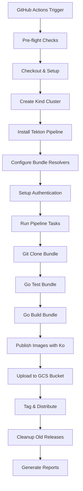

# Tekton Pipeline Nightly Releases

This document provides comprehensive information about setting up, configuring, and maintaining nightly releases for Tekton Pipelines using GitHub Actions and bundle resolvers.

## Table of Contents

- [Overview](#overview)
- [Architecture](#architecture)
- [Prerequisites](#prerequisites)
- [Fork Setup Guide](#fork-setup-guide)
- [Configuration](#configuration)
- [Testing](#testing)
- [Troubleshooting](#troubleshooting)
- [Production Considerations](#production-considerations)
- [Monitoring & Observability](#monitoring--observability)
- [Known Limitations](#known-limitations)
- [Contributing](#contributing)
- [Support](#support)

## Overview

The nightly release system automatically builds, tests, and publishes Tekton Pipeline container images and release artifacts on a daily schedule. This system is designed to work seamlessly across any fork of the Tekton Pipeline repository.

### Key Features

- **🔄 Automated Nightly Builds**: Scheduled releases at 03:00 UTC daily with automatic change detection
- **📦 Bundle Resolver Integration**: Uses Tekton Catalog bundle resolvers for enhanced ecosystem validation
- **🏗️ Multi-Platform Support**: Builds for linux/amd64, linux/arm64, linux/s390x, linux/ppc64le, windows/amd64
- **🔐 Secure Authentication**: GitHub Container Registry (GHCR) integration with token-based auth
- **🧪 Fork-Friendly**: Automatic detection and configuration for any repository fork
- **📊 Comprehensive Logging**: Detailed debugging and monitoring capabilities
- **🔄 Automatic Cleanup**: Configurable retention policies for old releases
- **⚡ Smart Builds**: Skip builds when no changes are detected (configurable)

## Architecture



### Components

1. **GitHub Actions Workflow** (`.github/workflows/nightly-release.yaml`)
   - Orchestrates the entire release process
   - Manages Kubernetes cluster lifecycle with Kind
   - Handles authentication and secrets management
   - Implements intelligent change detection
   - Manages multi-platform builds

2. **Tekton Pipeline** (`tekton/release-nightly-pipeline.yaml`)
   - Defines the CI/CD pipeline using bundle resolvers
   - Manages source code checkout, testing, and building
   - Integrates with Tekton Catalog for reusable tasks
   - Implements cleanup and retention policies

3. **Publishing Task** (`tekton/publish-nightly.yaml`)
   - Handles container image building with Ko
   - Manages image parsing and validation with koparse
   - Distributes images to container registry
   - Supports multi-platform image building
   - Handles Windows-specific image requirements

## Prerequisites

### For Fork Maintainers

- **GitHub Repository**: A fork of `tektoncd/pipeline` with Actions enabled
- **GitHub Container Registry**: Access to push images to `ghcr.io`
- **GitHub Secrets**: Properly configured authentication tokens
- **Kubernetes Knowledge**: Basic understanding of Kubernetes and Tekton
- **Storage Access**: GCS bucket for release artifacts (configurable)

### Required GitHub Secrets

| Secret Name | Description | Required Scopes | Example |
|-------------|-------------|-----------------|---------|
| `GHCR_TOKEN` | GitHub Personal Access Token for container registry access | `packages:write`, `contents:read` | `ghp_xxxxxxxxxxxx` |
| `GCS_SERVICE_ACCOUNT_KEY` | Google Cloud Service Account key for bucket access | Storage Admin | JSON key content |

**Note**: The workflow will fall back to `github.token` if `GHCR_TOKEN` is not provided, but this may have limited permissions.

### System Requirements

- **Kubernetes**: Version 1.29.0+ (managed by GitHub Actions using Kind)
- **Tekton Pipelines**: Latest stable version (auto-installed)
- **Container Registry**: GitHub Container Registry (ghcr.io)
- **Cloud Storage**: Google Cloud Storage bucket (for upstream) or configurable for forks

## Fork Setup Guide

### Step 1: Fork the Repository

1. Navigate to [tektoncd/pipeline](https://github.com/tektoncd/pipeline)
2. Click "Fork" and create your fork
3. Clone your fork locally:
   ```bash
   git clone https://github.com/YOUR_USERNAME/pipeline.git
   cd pipeline
   git checkout nightly-pipeline-gha  # Switch to the nightly release branch
   ```

### Step 2: Configure GitHub Secrets

> **Note**: For fork testing, use your own GCS bucket and GHCR repository with appropriate service account keys and tokens configured as repository secrets.

1. Go to your fork's **Settings → Secrets and Variables → Actions**
2. Add the following secrets:

   **GHCR_TOKEN** (Required):
   - Go to GitHub Settings → Developer Settings → Personal Access Tokens → Tokens (classic)
   - Click "Generate new token (classic)"
   - Select these scopes:
     - ✅ `packages:write` (required for pushing to GHCR)
     - ✅ `contents:read` (required for accessing repository)
   - Copy the token and add it as a secret

   **GCS_SERVICE_ACCOUNT_KEY** (Optional for forks):
   - Only required if you want to publish to your own GCS bucket
   - Create a Google Cloud Service Account with Storage Admin permissions
   - Download the JSON key file
   - Copy the entire JSON content as the secret value

### Step 3: Enable GitHub Actions

1. Go to your fork's **Actions** tab
2. Click "I understand my workflows, go ahead and enable them"
3. Find the "Tekton Nightly Release" workflow
4. Enable the workflow if it's disabled

### Step 4: Verify Container Registry Access

1. Ensure your GitHub account has access to GitHub Container Registry
2. The workflow will automatically push to `ghcr.io/YOUR_USERNAME/pipeline/`
3. Images will be publicly accessible by default

### Step 5: Test the Setup

Run a manual release to verify everything works:

1. Go to **Actions → Tekton Nightly Release**
2. Click "Run workflow"
3. Configure the run:
   - **Use workflow from**: `nightly-pipeline-gha`
   - **Kubernetes version**: `v1.31.0` (recommended)
   - **Force release**: `true` (for initial testing)
   - **Dry run**: `false` (set to true for testing without publishing)
4. Click "Run workflow"
5. Monitor the execution and check for any errors

## Configuration

### Environment Variables

The system automatically detects fork vs upstream repository and configures accordingly:

```yaml
# Automatic configuration based on repository
Repository: tektoncd/pipeline     → 
  - koExtraArgs: "--preserve-import-paths"
  - registryPath: "tekton-releases-nightly"
  - bucket: "gs://tekton-releases-nightly/pipeline"
  - runTests: "true"

Repository: YOUR_USERNAME/pipeline → 
  - koExtraArgs: ""
  - registryPath: "YOUR_USERNAME/pipeline"  
  - bucket: "gs://YOUR_USERNAME-tekton-nightly-test/pipeline"
  - runTests: "false"
```

### Customizable Parameters

Edit `.github/workflows/nightly-release.yaml` to customize:

```yaml
env:
  # Kubernetes version for testing
  KUBERNETES_VERSION: v1.31.0
  
  # Registry configuration
  REGISTRY: ghcr.io
  
  # Release configuration
  DRY_RUN: false
  FORCE_RELEASE: false

# Workflow inputs (configurable at runtime)
workflow_dispatch:
  inputs:
    kubernetes_version:
      default: 'v1.31.0'
      options: [v1.31.0, v1.30.0, v1.29.0]
    force_release:
      description: 'Force release even if no changes detected'
      default: false
    dry_run:
      description: 'Perform dry run (no actual publishing)'
      default: false
```

### Bundle Resolver Configuration

The system uses Tekton Catalog bundle resolvers with specific versions:

```yaml
# Current bundle versions (as of 2025)
taskRef:
  resolver: bundles
  params:
    - name: bundle
      value: ghcr.io/tektoncd/catalog/upstream/tasks/git-clone:0.10
    - name: bundle  
      value: ghcr.io/tektoncd/catalog/upstream/tasks/golang-test:0.2
    - name: bundle
      value: ghcr.io/tektoncd/catalog/upstream/tasks/golang-build:0.3
    - name: bundle
      value: ghcr.io/tektoncd/catalog/upstream/tasks/gcs-upload:0.3
```

**Note**: Bundle versions are periodically updated. Check the [Tekton Catalog](https://github.com/tektoncd/catalog) for the latest versions.

## Testing

### Automated Validation Scripts

The repository includes comprehensive testing tools:

```bash
# Test your setup manually
gh workflow run "Tekton Nightly Release" --ref nightly-pipeline-gha

# Check the run status
gh run watch
```

### Local Testing

Test individual components locally:

```bash
# Test bundle resolver tasks
tkn task start git-clone \
  --param url=https://github.com/YOUR_USERNAME/pipeline \
  --param revision=main \
  --workspace name=output,emptyDir=

# Test pipeline syntax
tkn pipeline describe release-nightly-pipeline

# Test Ko configuration
ko resolve --local -f config/ > /tmp/release-test.yaml
```

### Integration Testing

The system includes comprehensive integration tests:

1. **Cluster Setup Test**: Verifies Kind cluster creation and readiness
2. **Authentication Test**: Validates GHCR authentication and permissions
3. **Bundle Resolver Test**: Verifies bundle resolver connectivity
4. **Pipeline Execution Test**: Runs complete pipeline with validation
5. **Image Publishing Test**: Verifies image push to registry
6. **Cleanup Test**: Validates retention policy execution

### Manual Testing Checklist

Before production deployment:

- [ ] Fork setup completed successfully
- [ ] GitHub secrets configured with correct permissions
- [ ] Manual workflow run completed without errors
- [ ] Images appear in container registry (`ghcr.io/YOUR_USERNAME/pipeline/`)
- [ ] No authentication errors in workflow logs
- [ ] All pipeline tasks completed successfully
- [ ] Cleanup step executed (if enabled)
- [ ] Bundle resolvers accessible from test environment
- [ ] Multi-platform images built (if enabled)

## Troubleshooting

### Common Issues

#### 1. Authentication Failures

**Symptoms**: `permission denied`, `unauthorized`, or `403 Forbidden` errors

**Root Causes**:
- Incorrect token scopes
- Token expiration
- Repository permissions
- GHCR access issues

**Solutions**:
```bash
# Verify token scope and validity
curl -H "Authorization: token YOUR_TOKEN" \
  https://api.github.com/user

# Check container registry access
echo "YOUR_TOKEN" | docker login ghcr.io -u YOUR_USERNAME --password-stdin

# Test package permissions
curl -H "Authorization: token YOUR_TOKEN" \
  https://api.github.com/user/packages?package_type=container
```

**Prevention**:
- Use tokens with sufficient scopes (`packages:write`, `contents:read`)
- Set up token expiration reminders
- Test authentication before production use

#### 2. Bundle Resolver Issues

**Symptoms**: `failed to resolve bundle`, `bundle not found`, or resolution timeouts

**Root Causes**:
- Bundle resolver not installed or configured
- Network connectivity issues
- Incorrect bundle references
- Bundle registry unavailable

**Solutions**:
```bash
# Check bundle resolver installation
kubectl get deployment -n tekton-pipelines-resolvers

# Test bundle connectivity
tkn bundle list ghcr.io/tektoncd/catalog/upstream/tasks/git-clone:0.10

# Verify bundle resolver configuration
kubectl get configmap -n tekton-pipelines-resolvers resolvers-feature-flags
```

**Prevention**:
- Monitor bundle resolver health
- Use specific bundle versions (avoid `latest`)
- Implement fallback mechanisms for critical bundles

#### 3. Image Build Failures

**Symptoms**: Ko build errors, missing images, or build timeouts

**Root Causes**:
- Ko configuration issues
- Base image accessibility problems
- Build context problems
- Resource constraints

**Solutions**:
```bash
# Check Ko configuration
cat .ko.yaml

# Verify base images are accessible
docker pull cgr.dev/chainguard/static:latest

# Check vendor dependencies
go mod vendor
go mod verify

# Test Ko build locally
ko build --local ./cmd/controller
```

**Prevention**:
- Pin base image versions
- Validate Ko configuration in CI
- Monitor base image availability

#### 4. Pipeline Timeout Issues

**Symptoms**: Pipeline runs exceed time limits or hang indefinitely

**Root Causes**:
- Resource contention
- Network issues
- Large image builds
- Inefficient build processes

**Solutions**:
- Increase timeout values in pipeline spec:
```yaml
timeout: 3h  # Increase from default 1h
```
- Optimize image building process
- Use more efficient base images
- Implement build caching

#### 5. Storage and Bucket Issues

**Symptoms**: GCS upload failures, permission denied errors

**Root Causes**:
- Service account permissions
- Bucket access policies
- Network connectivity
- Quota limitations

**Solutions**:
```bash
# Test service account permissions
gcloud auth activate-service-account --key-file=key.json
gsutil ls gs://your-bucket/

# Check bucket permissions
gsutil iam get gs://your-bucket/
```

### Debug Mode

Enable detailed debugging by setting environment variables in the workflow:

```yaml
env:
  TEKTON_DEBUG: "true"
  KO_DEBUG: "true"
  KUBECTL_VERBOSE: "6"
```

### Log Analysis

Key logs to examine for troubleshooting:

1. **GitHub Actions Logs**: Overall workflow execution and setup
2. **Tekton Pipeline Logs**: Individual task execution details
3. **Ko Build Logs**: Image building process and errors  
4. **Container Registry Logs**: Image push operations and authentication
5. **Bundle Resolver Logs**: Task resolution and connectivity
6. **Kubernetes Cluster Logs**: Cluster setup and component status

### Getting Help

If you encounter issues not covered here:

1. Check the [GitHub Issues](https://github.com/tektoncd/pipeline/issues) for known problems
2. Review recent workflow runs for similar error patterns
3. Enable debug mode and collect detailed logs
4. Test individual components in isolation
5. Consult the [Tekton community](https://tekton.dev/community/) for support

## Production Considerations

### Security

1. **Token Management**:
   - Use GitHub secrets for all sensitive data
   - Rotate tokens regularly (recommended: quarterly)
   - Use least-privilege access principles
   - Monitor token usage and access patterns
   - Set token expiration dates

2. **Image Security**:
   - Scan images for vulnerabilities using tools like Trivy
   - Use distroless base images (already implemented)
   - Enable Tekton Chains for supply chain security
   - Implement image signing with Cosign
   - Regular security updates for base images

3. **Access Control**:
   - Limit workflow permissions to minimum required
   - Use environment protection rules for production
   - Enable branch protection on release branches
   - Implement RBAC for Kubernetes clusters
   - Regular access reviews

4. **Supply Chain Security**:
   - Pin all dependencies to specific versions
   - Verify bundle and image signatures
   - Use SBOM (Software Bill of Materials) generation
   - Implement vulnerability scanning in CI/CD

### Performance Optimization

1. **Build Optimization**:
   ```yaml
   # Use build caching (implemented in workflow)
   env:
     GOCACHE: /workspace/.cache/go-build
     GOMODCACHE: /workspace/.cache/go-mod
   ```

2. **Resource Management**:
   ```yaml
   # Configure resource limits for tasks
   resources:
     requests:
       memory: "1Gi"
       cpu: "500m"
     limits:
       memory: "4Gi" 
       cpu: "2"
   ```

3. **Parallel Execution**:
   - Use matrix builds for multiple platforms (already implemented)
   - Parallelize independent tasks where possible
   - Optimize image layer caching strategies
   - Use concurrent uploads for multi-platform images

4. **Network Optimization**:
   - Use regional mirrors for base images
   - Implement registry pull-through caches
   - Optimize bundle resolver connectivity

### Reliability

1. **Retry Logic**:
   ```yaml
   # Add retry for flaky operations (implemented in workflow)
   retries: 3
   retry_on: failure
   backoff: exponential
   ```

2. **Health Checks**:
   - Monitor pipeline success rates
   - Set up alerting for consecutive failures
   - Implement graceful degradation strategies
   - Health endpoints for critical services

3. **Backup Strategies**:
   - Multiple registry mirrors for redundancy
   - Fallback authentication methods
   - Recovery procedures for common failures
   - Regular backup testing

4. **Capacity Planning**:
   - Monitor resource usage trends
   - Plan for peak build times
   - Implement auto-scaling where possible
   - Regular capacity reviews

### Compliance and Governance

1. **Audit Logging**:
   - Enable comprehensive audit logs
   - Log all authentication events
   - Track image provenance
   - Regular log analysis

2. **Compliance Requirements**:
   - Meet organizational security standards
   - Implement required approval processes
   - Document security controls
   - Regular compliance assessments

## Monitoring & Observability

### Key Metrics to Track

1. **Build Metrics**:
   - Build success rate (target: >95%)
   - Build duration (track trends and outliers)
   - Image size trends (monitor bloat)
   - Resource utilization (CPU, memory, storage)
   - Build frequency and triggers

2. **Pipeline Metrics**:
   - Pipeline execution time (end-to-end)
   - Task failure rates by component
   - Queue wait times 
   - Throughput (builds per day/week)
   - Bundle resolver performance

3. **Registry Metrics**:
   - Image push success rate
   - Image pull statistics
   - Storage usage and costs
   - Access patterns and geographic distribution
   - Authentication success/failure rates

4. **Infrastructure Metrics**:
   - Kind cluster creation time
   - Tekton installation success rate
   - Network latency to external services
   - Bundle resolver availability

### Alerting Strategy

Set up alerts for:

**Critical Issues** (immediate response):
- Build failures (>2 consecutive failures)
- Authentication errors
- Registry unavailability
- Pipeline stuck/hanging (>2 hours)

**Warning Issues** (response within 24h):
- Build duration increase (>50% baseline)
- High resource utilization (>80%)
- Bundle resolver latency increase
- Storage quota approaching limits

**Informational**:
- Successful build notifications
- Weekly/monthly summary reports
- Performance trend reports

### Dashboard Examples

Create monitoring dashboards with:

1. **Executive Dashboard**:
   - Build success rate (last 30 days)
   - Average build time trends  
   - Cost metrics and optimization opportunities
   - Security posture summary

2. **Operational Dashboard**:
   - Real-time build status
   - Resource utilization
   - Error rates by component
   - Performance metrics

3. **Developer Dashboard**:
   - Recent build history
   - Failure analysis
   - Build duration comparisons
   - Image size trends

### Observability Tools

Recommended tools for monitoring:

- **Metrics**: Prometheus + Grafana
- **Logging**: ELK Stack or Loki
- **Tracing**: Jaeger (for complex pipelines)
- **Alerting**: AlertManager, PagerDuty, or Slack
- **Cost Monitoring**: Cloud billing alerts

## Known Limitations

### Current Limitations

1. **Platform Support**:
   - Windows container support is experimental
   - ARM64 builds may be slower than AMD64
   - s390x and ppc64le support depends on base image availability

2. **Bundle Resolver Dependencies**:
   - Requires network connectivity to ghcr.io
   - Bundle versions are manually managed
   - No automatic fallback for bundle failures

3. **Storage Requirements**:
   - GCS bucket required for full functionality
   - Large images may hit storage quotas
   - No automatic cleanup of very old releases

4. **Scalability Constraints**:
   - Single workflow execution at a time
   - Limited parallel task execution
   - GitHub Actions runtime limits (6 hours max)

### Workarounds

For current limitations:

1. **Bundle Failures**: 
   - Pin specific working versions
   - Implement manual fallbacks
   - Monitor bundle registry status

2. **Storage Issues**:
   - Implement aggressive cleanup policies
   - Use compression for artifacts
   - Monitor storage usage proactively

3. **Performance Issues**:
   - Use build caching aggressively
   - Optimize image layers
   - Consider build farm alternatives for large teams

## Contributing

When contributing to the nightly release system:

### Development Process

1. **Test Changes in Your Fork**:
   - Always test in your fork before proposing changes
   - Use dry-run mode for validation
   - Test with multiple Kubernetes versions

2. **Clean Up Before Submitting PRs**:
   - Remove personal bucket names and credentials from workflow files

3. **Documentation Updates**:
   - Update relevant documentation for any changes
   - Include examples for new features
   - Update troubleshooting guides as needed

4. **Backward Compatibility**:
   - Ensure changes don't break existing forks
   - Provide migration guides for breaking changes
   - Maintain deprecated features appropriately

5. **Error Handling**:
   - Add comprehensive error handling
   - Include debugging information
   - Provide clear error messages

6. **Monitoring and Logging**:
   - Add appropriate logging for new features
   - Include metrics for performance tracking
   - Update alerting rules as needed

### Testing Requirements

- [ ] Unit tests for new functionality
- [ ] Integration tests with Kind cluster
- [ ] End-to-end testing in fork environment
- [ ] Performance impact assessment
- [ ] Security review for sensitive changes

## Support

### Getting Help

For issues with the nightly release system:

1. **Self-Service Resources**:
   - Check this documentation first
   - Review GitHub Actions logs in your repository
   - Test manually using: `gh workflow run "Tekton Nightly Release"`

2. **Community Support**:
   - [Tekton Slack](https://tektoncd.slack.com/) - #pipeline channel
   - [GitHub Discussions](https://github.com/tektoncd/pipeline/discussions)
   - [Stack Overflow](https://stackoverflow.com/questions/tagged/tekton) - Use `tekton` tag

3. **Issue Reporting**:
   - Open an issue with reproduction steps
   - Include relevant logs and configuration
   - Specify environment details (OS, Kubernetes version, etc.)
   - Use issue templates when available

### Issue Templates

When reporting issues, include:

**Environment Information**:
- Fork repository URL
- Kubernetes version used
- Tekton Pipeline version
- Bundle resolver versions

**Problem Description**:
- Expected behavior
- Actual behavior
- Error messages and logs
- Steps to reproduce

**Troubleshooting Done**:
- Validation scripts run
- Documentation consulted
- Similar issues checked

### Support Escalation

For urgent production issues:
1. Use appropriate issue labels (`priority/critical`)
2. Include impact assessment
3. Tag relevant maintainers

---

## Appendix

### Complete Example Configuration

See the following files for complete configuration examples:
- [nightly-release.yaml](../.github/workflows/nightly-release.yaml) - Main workflow
- [release-nightly-pipeline.yaml](../tekton/release-nightly-pipeline.yaml) - Tekton pipeline
- [publish-nightly.yaml](../tekton/publish-nightly.yaml) - Publishing task

### Related Documentation

- [Tekton Pipelines Documentation](https://tekton.dev/docs/pipelines/)
- [GitHub Container Registry](https://docs.github.com/en/packages/working-with-a-github-packages-registry/working-with-the-container-registry)
- [Tekton Bundle Resolver](https://tekton.dev/docs/pipelines/bundle-resolver/)
- [Ko Documentation](https://ko.build/)
- [Kind Documentation](https://kind.sigs.k8s.io/)

### Glossary

**Bundle Resolver**: Tekton component that resolves task and pipeline references from OCI bundles
**GHCR**: GitHub Container Registry, used for storing container images
**Kind**: Kubernetes in Docker, used for local Kubernetes clusters
**Ko**: Tool for building and deploying Go applications on Kubernetes
**Koparse**: Tool for parsing Ko build results and extracting image information

### License

This project is licensed under the Apache License 2.0 - see the [LICENSE](../LICENSE) file for details.
