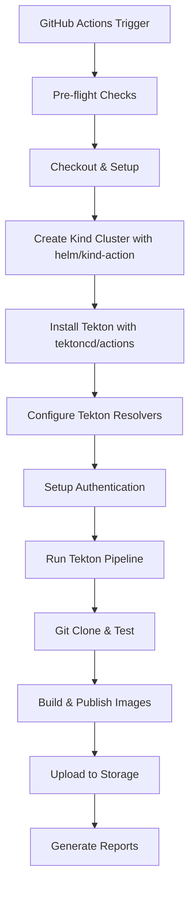

# Tekton Pipeline Nightly Releases

This document provides comprehensive information about setting up, configuring, and maintaining nightly releases for Tekton Pipelines using GitHub Actions and bundle resolvers.

## Table of Contents

- [Overview](#overview)
- [Architecture](#architecture)
- [Prerequisites](#prerequisites)
- [Fork Setup Guide](#fork-setup-guide)
- [Configuration](#configuration)
- [Testing](#testing)
- [Troubleshooting](#troubleshooting)
- [Production Considerations](#production-considerations)
- [Monitoring & Observability](#monitoring--observability)
- [Known Limitations](#known-limitations)
- [Contributing](#contributing)
- [Support](#support)

## Overview

The nightly release system automatically builds, tests, and publishes Tekton Pipeline container images and release artifacts on a daily schedule. This system is designed to work seamlessly across any fork of the Tekton Pipeline repository.

### Key Features

- **Automated Nightly Builds**: Scheduled releases at 03:00 UTC daily with automatic change detection
- **Bundle Resolver Integration**: Uses Tekton Catalog bundle resolvers for enhanced ecosystem validation
- **Multi-Platform Support**: Builds for linux/amd64, linux/arm64, linux/s390x, linux/ppc64le, windows/amd64
- **Secure Authentication**: GitHub Container Registry (GHCR) integration with token-based auth
- **Fork-Friendly**: Automatic detection and configuration for any repository fork
- **Comprehensive Logging**: Detailed debugging and monitoring capabilities
- **Automatic Cleanup**: Configurable retention policies for old releases
- **Smart Builds**: Skip builds when no changes are detected (configurable)

## Architecture



### Components

1. **GitHub Actions Workflow** (`.github/workflows/nightly-release.yaml`)
   - Orchestrates the entire release process
   - Uses `helm/kind-action@v1.8.0` for Kubernetes cluster setup
   - Uses `tektoncd/actions/setup-tektoncd@main` for Tekton installation
   - Handles authentication and secrets management
   - Implements intelligent change detection

2. **Tekton Pipeline** (`tekton/release-nightly-pipeline.yaml`)
   - Defines the CI/CD pipeline using bundle resolvers
   - Manages source code checkout, testing, and building
   - Integrates with Tekton Catalog for reusable tasks

3. **Publishing Task** (`tekton/publish-nightly.yaml`)
   - Handles container image building with Ko
   - Publishes images to GitHub Container Registry (GHCR)
   - Supports multi-platform image building

## Prerequisites

### For Fork Maintainers

- **GitHub Repository**: A fork of `tektoncd/pipeline` with Actions enabled
- **GitHub Container Registry**: Access to push images to `ghcr.io`
- **GitHub Secrets**: Properly configured authentication tokens
- **Kubernetes Knowledge**: Basic understanding of Kubernetes and Tekton
- **Storage Access**: GCS bucket for release artifacts (configurable)

### Required GitHub Secrets

| Secret Name | Description | Required Scopes | Example |
|-------------|-------------|-----------------|---------|
| `GHCR_TOKEN` | GitHub Personal Access Token for container registry access | `packages:write`, `contents:read` | `ghp_xxxxxxxxxxxx` |
| `GCS_SERVICE_ACCOUNT_KEY` | Google Cloud Service Account key for bucket access | Storage Admin | JSON key content |

**Note**: The workflow will fall back to `github.token` if `GHCR_TOKEN` is not provided, but this may have limited permissions.

### System Requirements

- **Kubernetes**: Version 1.29.0+ (automatically managed by Kind)
- **Tekton Pipelines**: Latest stable version (auto-installed)
- **Container Registry**: GitHub Container Registry (ghcr.io)

## Fork Setup Guide

### Step 1: Fork the Repository

1. Navigate to [tektoncd/pipeline](https://github.com/tektoncd/pipeline)
2. Click "Fork" and create your fork
3. Clone your fork locally:
   ```bash
   git clone https://github.com/YOUR_USERNAME/pipeline.git
   cd pipeline
   git checkout nightly-pipeline-gha  # Switch to the nightly release branch
   ```

### Step 2: Configure GitHub Secrets

> **Note**: For fork testing, use your own GCS bucket and GHCR repository with appropriate service account keys and tokens configured as repository secrets.

1. Go to your fork's **Settings → Secrets and Variables → Actions**
2. Add the following secrets:

   **GHCR_TOKEN** (Required):
   - Go to GitHub Settings → Developer Settings → Personal Access Tokens → Tokens (classic)
   - Click "Generate new token (classic)"
   - Select these scopes:
     - ✅ `packages:write` (required for pushing to GHCR)
     - ✅ `contents:read` (required for accessing repository)
   - Copy the token and add it as a secret

   **GCS_SERVICE_ACCOUNT_KEY** (Required for bucket uploads):
   - Create a Google Cloud Service Account with Storage Admin permissions
   - Download the JSON key file
   - Copy the entire JSON content as the secret value

### Step 3: Enable GitHub Actions

1. Go to your fork's **Actions** tab
2. Click "I understand my workflows, go ahead and enable them"
3. Find the "Tekton Nightly Release" workflow
4. Enable the workflow if it's disabled

### Step 4: Verify Container Registry Access

1. Ensure your GitHub account has access to GitHub Container Registry
2. The workflow will automatically push to `ghcr.io/YOUR_USERNAME/pipeline/`
3. Images will be publicly accessible by default

### Step 5: Configure Storage Bucket (Optional)

By default, the workflow will use a bucket named after your GitHub username: `gs://YOUR_USERNAME-tekton-nightly-test/pipeline`

If you want to use a different bucket:
1. Create your own GCS bucket
2. When manually running the workflow, set the **test_bucket** input parameter to your bucket name (e.g., `gs://my-custom-bucket/pipeline`)
3. Alternatively, you can modify the workflow file to set a different default bucket

### Step 6: Test the Setup

Run a manual release to verify everything works:

1. Go to **Actions → Tekton Nightly Release**
2. Click "Run workflow"
3. Configure the run:
   - **Use workflow from**: `nightly-pipeline-gha`
   - **Kubernetes version**: `v1.31.0` (recommended)
   - **Force release**: `true` (for initial testing)
   - **Dry run**: `false` (set to true for testing without publishing)
   - **Test bucket**: Leave empty to use default `gs://YOUR_USERNAME-tekton-nightly-test/pipeline` or specify custom bucket
4. Click "Run workflow"
5. Monitor the execution and check for any errors

## Configuration

### Environment Variables

The system automatically detects fork vs upstream repository and configures accordingly:

```yaml
# Automatic configuration based on repository
Repository: tektoncd/pipeline     → 
  - koExtraArgs: "--preserve-import-paths"
  - registryPath: "tekton-releases-nightly"
  - bucket: "gs://tekton-releases-nightly/pipeline"
  - runTests: "true"

Repository: YOUR_USERNAME/pipeline → 
  - koExtraArgs: ""
  - registryPath: "YOUR_USERNAME/pipeline"  
  - bucket: "gs://YOUR_USERNAME-tekton-nightly-test/pipeline"
  - runTests: "false"
```

### Customizable Parameters

Key configuration options in `.github/workflows/nightly-release.yaml`:

```yaml
# Cluster setup
- name: Set up Kind cluster
  uses: helm/kind-action@v1.8.0
  with:
    node_image: kindest/node:${{ env.KUBERNETES_VERSION }}
    cluster_name: tekton-nightly

# Tekton setup  
- name: Set up Tekton
  uses: tektoncd/actions/setup-tektoncd@main
  with:
    pipeline_version: latest
    feature_flags: '{}'
    cli_version: latest
    setup_registry: "true"
    patch_etc_hosts: "true"
```

### Bundle Resolver Configuration

The system uses Tekton Catalog bundle resolvers for reusable tasks:

```yaml
# Example bundle task references
taskRef:
  resolver: bundles
  params:
    - name: bundle
      value: ghcr.io/tektoncd/catalog/upstream/tasks/git-clone:0.10
```
### License

This project is licensed under the Apache License 2.0 - see the [LICENSE](../LICENSE) file for details.
