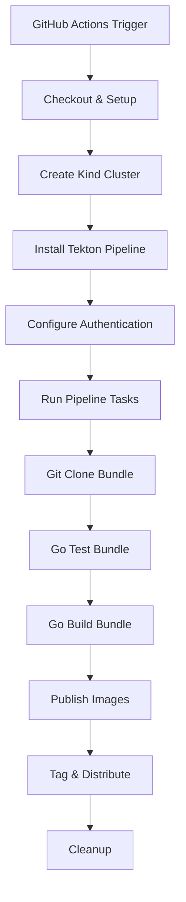

# Tekton Pipeline Nightly Releases

This document provides comprehensive information about setting up, configuring, and maintaining nightly releases for Tekton Pipelines using GitHub Actions and bundle resolvers.

## Table of Contents

- [Overview](#overview)
- [Architecture](#architecture)
- [Prerequisites](#prerequisites)
- [Fork Setup Guide](#fork-setup-guide)
- [Configuration](#configuration)
- [Testing](#testing)
- [Troubleshooting](#troubleshooting)
- [Production Considerations](#production-considerations)
- [Monitoring & Observability](#monitoring--observability)

## Overview

The nightly release system automatically builds, tests, and publishes Tekton Pipeline container images and release artifacts on a daily schedule. This system is designed to work seamlessly across any fork of the Tekton Pipeline repository.

### Key Features

- **🔄 Automated Nightly Builds**: Scheduled releases at 03:00 UTC daily
- **📦 Bundle Resolver Integration**: Uses Tekton Catalog bundle resolvers for enhanced ecosystem validation
- **🏗️ Multi-Platform Support**: Builds for linux/amd64, linux/arm64, linux/s390x, linux/ppc64le, windows/amd64
- **🔐 Secure Authentication**: GitHub Container Registry (GHCR) integration with token-based auth
- **🧪 Fork-Friendly**: Automatic detection and configuration for any repository fork
- **📊 Comprehensive Logging**: Detailed debugging and monitoring capabilities

## Architecture



### Components

1. **GitHub Actions Workflow** (`.github/workflows/nightly-release.yaml`)
   - Orchestrates the entire release process
   - Manages Kubernetes cluster lifecycle
   - Handles authentication and secrets

2. **Tekton Pipeline** (`tekton/release-nightly-pipeline.yaml`)
   - Defines the CI/CD pipeline using bundle resolvers
   - Manages source code checkout, testing, and building

3. **Publishing Task** (`tekton/publish-nightly.yaml`)
   - Handles container image building with Ko
   - Manages image parsing and validation with koparse
   - Distributes images to container registry

## Prerequisites

### For Fork Maintainers

- **GitHub Repository**: A fork of `tektoncd/pipeline`
- **GitHub Container Registry**: Access to push images to `ghcr.io`
- **GitHub Secrets**: Properly configured authentication tokens
- **Kubernetes Knowledge**: Basic understanding of Kubernetes and Tekton

### Required GitHub Secrets

| Secret Name | Description | Example |
|-------------|-------------|---------|
| `NIGHTLY_RELEASE_TOKEN` | GitHub Personal Access Token with packages:write scope | `ghp_xxxxxxxxxxxx` |

### System Requirements

- **Kubernetes**: Version 1.31.0+ (managed by GitHub Actions)
- **Tekton Pipelines**: Latest stable version (auto-installed)
- **Container Registry**: GitHub Container Registry (ghcr.io)

## Fork Setup Guide

### Step 1: Fork the Repository

1. Navigate to [tektoncd/pipeline](https://github.com/tektoncd/pipeline)
2. Click "Fork" and create your fork
3. Clone your fork locally:
   ```bash
   git clone https://github.com/YOUR_USERNAME/pipeline.git
   cd pipeline
   ```

### Step 2: Configure GitHub Secrets

1. Go to your fork's **Settings → Secrets and Variables → Actions**
2. Add the following secrets:

   **NIGHTLY_RELEASE_TOKEN**:
   - Go to GitHub Settings → Developer Settings → Personal Access Tokens
   - Create a token with `packages:write` and `contents:read` scopes
   - Copy the token and add it as a secret

### Step 3: Enable GitHub Actions

1. Go to your fork's **Actions** tab
2. Click "I understand my workflows, go ahead and enable them"
3. Find the "Nightly Tekton Release" workflow
4. Enable the workflow if it's disabled

### Step 4: Verify Container Registry Access

1. Ensure your GitHub account has access to GitHub Container Registry
2. The workflow will automatically push to `ghcr.io/YOUR_USERNAME/pipeline/`

### Step 5: Test the Setup

Run a manual release to verify everything works:

1. Go to **Actions → Nightly Tekton Release**
2. Click "Run workflow"
3. Select the `nightly-pipeline-gha` branch
4. Click "Run workflow"

## Configuration

### Environment Variables

The system automatically detects fork vs upstream repository and configures accordingly:

```yaml
# Automatic configuration based on repository
Repository: tektoncd/pipeline     → koExtraArgs: "--preserve-import-paths"
Repository: YOUR_USERNAME/pipeline → koExtraArgs: ""
```

### Customizable Parameters

Edit `.github/workflows/nightly-release.yaml` to customize:

```yaml
env:
  # Kubernetes version for testing
  KUBERNETES_VERSION: v1.31.0
  
  # Image registry configuration
  IMAGE_REGISTRY: ghcr.io
  IMAGE_REGISTRY_PATH: ${{ github.repository_owner }}/pipeline
  
  # Version tag format
  VERSION_TAG: v20250721-${GITHUB_SHA::7}
```

### Bundle Resolver Configuration

The system uses Tekton Catalog bundle resolvers:

```yaml
# Current bundle versions
- git-clone: ghcr.io/tektoncd/catalog/upstream/tasks/git-clone:0.10
- golang-test: ghcr.io/tektoncd/catalog/upstream/tasks/golang-test:0.2
- golang-build: ghcr.io/tektoncd/catalog/upstream/tasks/golang-build:0.3
```

## Testing

### Local Testing

Test individual components locally:

```bash
# Test bundle resolver tasks
tkn task start git-clone \
  --param url=https://github.com/YOUR_USERNAME/pipeline \
  --param revision=main \
  --workspace name=output,emptyDir=

# Test pipeline syntax
tkn pipeline describe release-nightly-pipeline
```

### Integration Testing

The system includes comprehensive integration tests:

1. **Cluster Setup Test**: Verifies Kind cluster creation
2. **Authentication Test**: Validates GHCR authentication
3. **Pipeline Execution Test**: Runs complete pipeline
4. **Image Publishing Test**: Verifies image push to registry

### Manual Testing Checklist

Before production deployment:

- [ ] Fork setup completed
- [ ] GitHub secrets configured
- [ ] Manual workflow run successful
- [ ] Images appear in container registry
- [ ] No authentication errors
- [ ] All pipeline steps complete
- [ ] Cleanup successful

## Troubleshooting

### Common Issues

#### 1. Authentication Failures

**Symptoms**: `permission denied` or `unauthorized` errors

**Solutions**:
```bash
# Verify token scope
curl -H "Authorization: token YOUR_TOKEN" \
  https://api.github.com/user

# Check container registry access
docker login ghcr.io -u YOUR_USERNAME -p YOUR_TOKEN
```

#### 2. Bundle Resolver Issues

**Symptoms**: `failed to resolve bundle` errors

**Solutions**:
- Verify bundle resolver is installed in cluster
- Check bundle reference format
- Ensure network connectivity to ghcr.io

#### 3. Image Build Failures

**Symptoms**: Ko build errors or missing images

**Solutions**:
```bash
# Check Ko configuration
cat .ko.yaml

# Verify base images are accessible
docker pull cgr.dev/chainguard/static:latest

# Check vendor dependencies
go mod vendor
```

#### 4. Pipeline Timeout Issues

**Symptoms**: Pipeline runs exceed time limits

**Solutions**:
- Increase timeout values in pipeline spec
- Optimize image building process
- Use more efficient base images

### Debug Mode

Enable detailed debugging by setting environment variables:

```yaml
env:
  TEKTON_DEBUG: "true"
  KO_DEBUG: "true"
```

### Log Analysis

Key logs to examine:

1. **GitHub Actions Logs**: Overall workflow execution
2. **Tekton Pipeline Logs**: Individual task execution
3. **Ko Build Logs**: Image building process
4. **Container Registry Logs**: Image push operations

## Production Considerations

### Security

1. **Token Management**:
   - Use GitHub secrets for all sensitive data
   - Rotate tokens regularly (quarterly)
   - Use least-privilege access principles

2. **Image Security**:
   - Scan images for vulnerabilities
   - Use distroless base images
   - Enable Tekton Chains for supply chain security

3. **Access Control**:
   - Limit workflow permissions
   - Use environment protection rules
   - Enable branch protection

### Performance Optimization

1. **Build Optimization**:
   ```yaml
   # Use build caching
   env:
     GOCACHE: /workspace/.cache/go-build
     GOMODCACHE: /workspace/.cache/go-mod
   ```

2. **Resource Management**:
   ```yaml
   # Configure resource limits
   resources:
     requests:
       memory: "1Gi"
       cpu: "500m"
     limits:
       memory: "4Gi"
       cpu: "2"
   ```

3. **Parallel Execution**:
   - Use matrix builds for multiple platforms
   - Parallelize independent tasks
   - Optimize image layer caching

### Reliability

1. **Retry Logic**:
   ```yaml
   # Add retry for flaky operations
   retries: 3
   retry_on: failure
   ```

2. **Health Checks**:
   - Monitor pipeline success rates
   - Set up alerting for failures
   - Implement graceful degradation

3. **Backup Strategies**:
   - Multiple registry mirrors
   - Fallback authentication methods
   - Recovery procedures

## Monitoring & Observability

### Metrics to Track

1. **Build Metrics**:
   - Build success rate
   - Build duration
   - Image size trends
   - Resource utilization

2. **Pipeline Metrics**:
   - Pipeline execution time
   - Task failure rates
   - Queue wait times
   - Throughput

3. **Registry Metrics**:
   - Image push success rate
   - Download statistics
   - Storage usage
   - Access patterns

### Alerting

Set up alerts for:
- Build failures
- Authentication errors
- Resource exhaustion
- Long-running pipelines

### Dashboard

Create monitoring dashboards with:
- Build status overview
- Historical trends
- Error rate analysis
- Performance metrics

## Contributing

When contributing to the nightly release system:

1. Test changes in your fork first
2. Update documentation for any configuration changes
3. Ensure backward compatibility
4. Add appropriate error handling
5. Include monitoring and logging

## Support

For issues with the nightly release system:

1. Check this documentation first
2. Review GitHub Actions logs
3. Examine Tekton pipeline logs
4. Open an issue with reproduction steps

---

## Appendix

### Complete Example Configuration

See the following files for complete configuration examples:
- [nightly-release.yaml](.github/workflows/nightly-release.yaml)
- [release-nightly-pipeline.yaml](tekton/release-nightly-pipeline.yaml)
- [publish-nightly.yaml](tekton/publish-nightly.yaml)

### Version History

| Version | Date | Changes |
|---------|------|---------|
| 1.0.0 | 2025-01-21 | Initial production release |

### License

This project is licensed under the Apache License 2.0 - see the [LICENSE](LICENSE) file for details.
